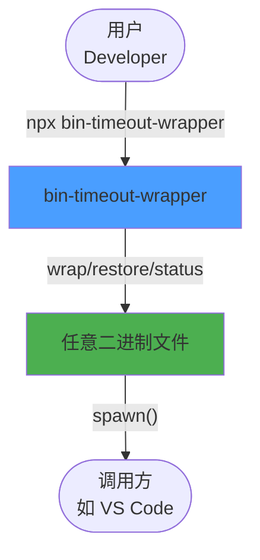
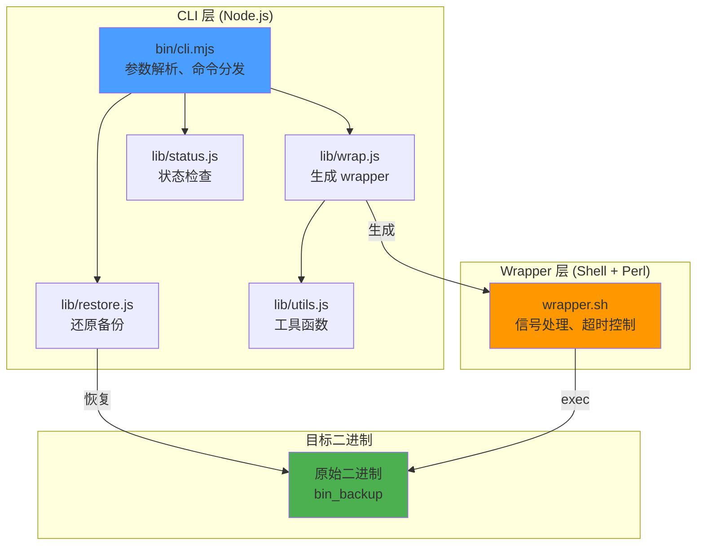
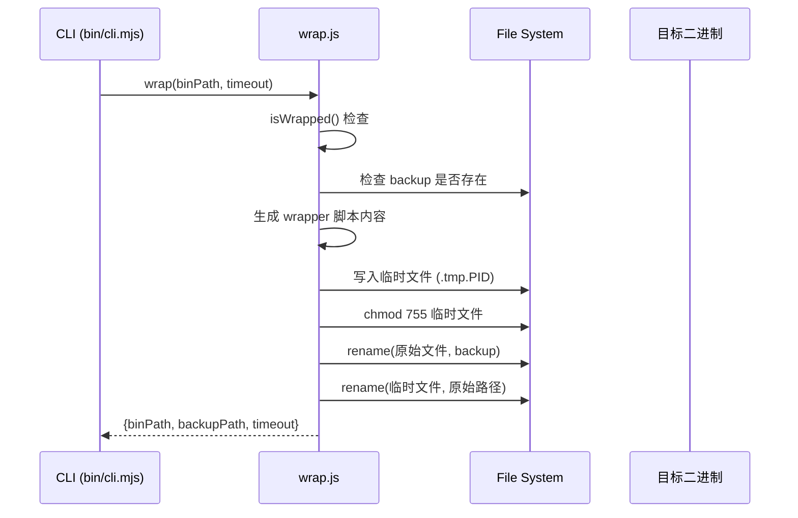
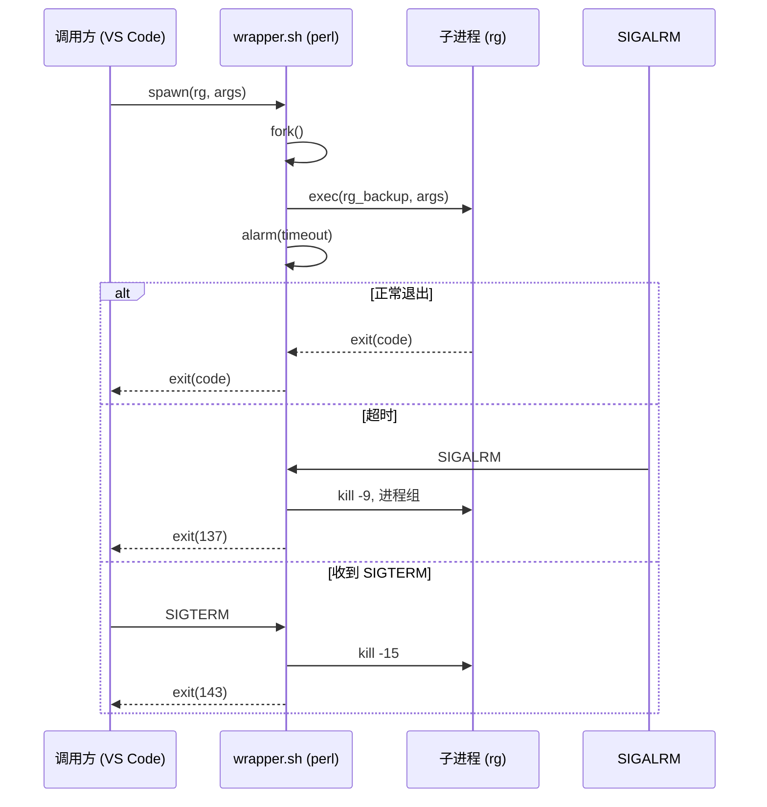
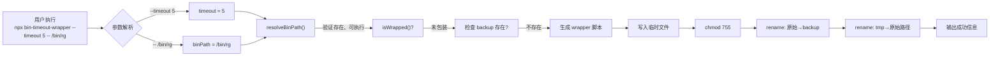
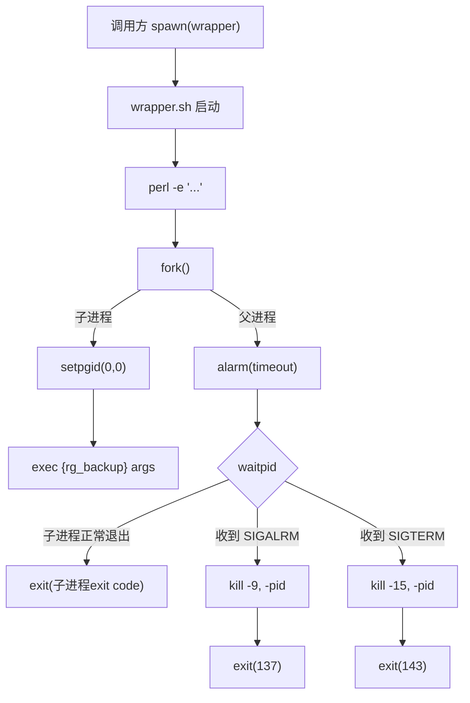
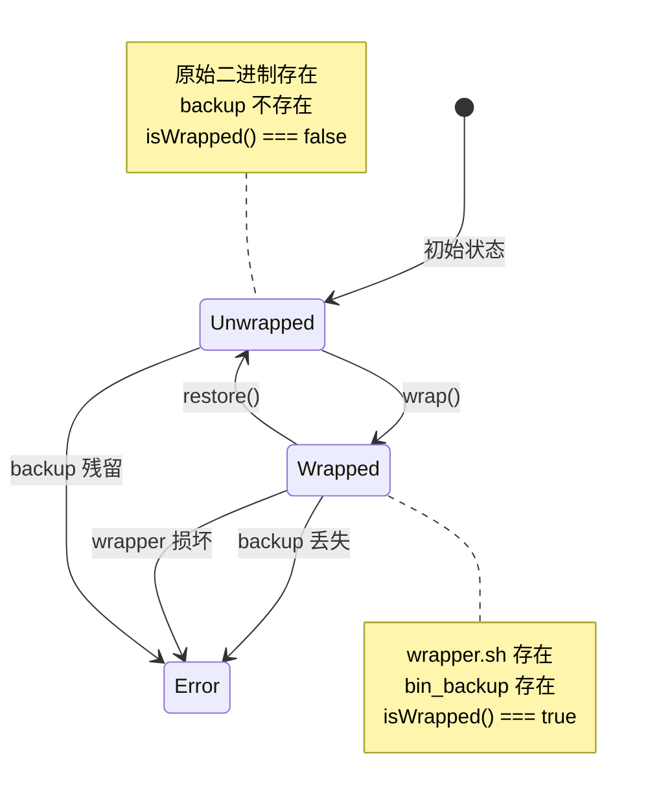
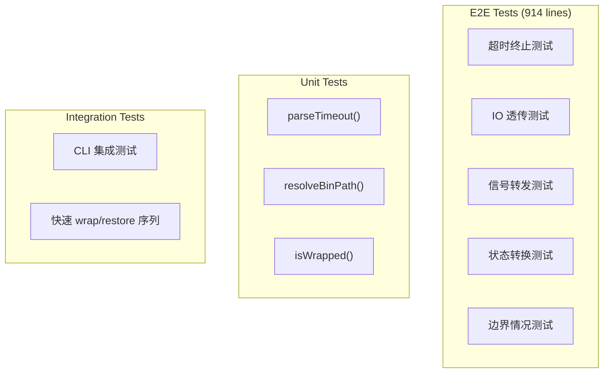

# @lionad/bin-timeout-wrapper 技术文档

## 项目概述

**@lionad/bin-timeout-wrapper** 是一个通用二进制文件超时保护工具，通过一行 `npx` 命令即可为任意可执行文件添加超时保护机制，超时后自动终止进程并返回错误码 137（SIGKILL）。

### 核心目标

解决 VS Code 内置 ripgrep (rg) 偶尔死循环、CPU 占满的问题——无需深入排查 VSCode、插件或 rg 源码，通过"外部包装"的方式为任意二进制添加超时保护。

### 核心特性

- **零配置**: 一行命令完成包装，无需修改调用方代码
- **透明代理**: 完全透传 stdin/stdout/stderr、参数、退出码
- **可逆操作**: 随时 `--restore` 还原原始二进制
- **运行时配置**: 支持 `BIN_TIMEOUT` 环境变量动态调整超时
- **信号转发**: 正确处理 SIGTERM/SIGINT，优雅终止子进程

---

## 技术架构

### 技术栈

| 层级 | 技术 | 说明 |
|------|------|------|
| CLI | Node.js (ESM) | npx 入口，参数解析，操作协调 |
| Wrapper | POSIX sh + Perl | 生成的包装脚本，信号处理 |
| 测试 | Vitest | E2E 测试，真实进程测试 |

### 项目结构

```
@lionad/bin-timeout-wrapper/
├── bin/
│   └── cli.mjs          # CLI 入口 (108 lines)
├── lib/
│   ├── wrap.js          # 包装逻辑：生成 wrapper 脚本 (68 lines)
│   ├── restore.js       # 还原逻辑 (16 lines)
│   ├── status.js        # 状态检查 (19 lines)
│   └── utils.js         # 工具函数 (63 lines)
├── tests/
│   └── e2e.test.mjs     # E2E 测试套件 (914 lines)
├── docs/
│   ├── design.md        # 设计文档
│   └── engine-review.md # 测试计划
├── package.json         # npm 配置
└── README.md            # 用户文档
```

### 代码统计

```
Language     Files    Lines    Purpose
─────────────────────────────────────────────
JavaScript       5      274    核心实现
JavaScript       1      914    测试套件
Markdown         3      ~200   文档
─────────────────────────────────────────────
Total            9    ~1,400
```

---

## 系统架构 (C4 Model)

### Level 1: System Context



### Level 2: Container Architecture



### Level 3: Component Details

#### Wrap 组件流程



#### Wrapper 脚本执行流程



---

## 核心实现详解

### 1. Wrapper 脚本模板

```perl
#!/bin/sh
# Auto-generated by @lionad/bin-timeout-wrapper

TIMEOUT="${BIN_TIMEOUT:-__TIMEOUT__}"
exec perl -e '
  use strict;
  use warnings;
  use POSIX qw(setpgid);

  my $timeout = $ARGV[0];
  die "Invalid BIN_TIMEOUT: $timeout\n" unless $timeout =~ /^\d+$/;

  my @cmd = @ARGV[1..$#ARGV];
  defined(my $pid = fork()) or die "fork: $!\n";

  if ($pid == 0) {
    setpgid(0, 0);           # 创建新进程组
    exec { $cmd[0] } @cmd;   # 直接 exec，避免 shell 解释
    die "exec: $!\n";
  }

  # 信号处理
  $SIG{ALRM} = sub { kill 9, -$pid; exit(137); };  # 超时 SIGKILL
  $SIG{TERM} = sub { kill 15, -$pid; exit(143); }; # 转发 SIGTERM
  $SIG{INT}  = sub { kill 2,  -$pid; exit(130); };  # 转发 SIGINT

  alarm $timeout;
  waitpid($pid, 0);
  exit($? >> 8 == 0 ? ($? & 127) ? 128 + ($? & 127) : 0 : $? >> 8);
' -- "$TIMEOUT" '/path/to/bin_backup' "$@"
```

**关键设计决策：**

| 设计点 | 决策 | 理由 |
|--------|------|------|
| fork/exec 而非直接 exec | 使用 fork() | 直接 exec 会丢失 perl 的 SIGALRM handler |
| setpgid(0,0) | 创建新进程组 | kill -$pid 可终止整个进程组，防止子进程 fork 逃逸 |
| exec { $cmd[0] } @cmd | 数组形式 exec | 避免 perl 的间接 shell 解释，防止命令注入 |
| 先写 tmp 再 rename | 原子替换 | 最小化崩溃窗口，避免文件损坏 |
| 单引号转义 | shellSingleQuote() | 处理路径中的特殊字符和单引号 |

### 2. 核心模块职责

#### lib/wrap.js

```javascript
// 主要职责：
// 1. 检查是否已被包装（避免重复包装）
// 2. 检查 backup 是否存在（防止冲突）
// 3. 生成 wrapper 脚本（可选启用日志）
// 4. 原子性替换：tmp → backup → wrapper

export async function wrap(binPath, timeout, enableLog = false) {
  const resolvedPath = resolveBinPath(binPath);

  if (isWrapped(resolvedPath)) {
    throw new Error(`Already wrapped: ${resolvedPath}`);
  }

  const backupPath = resolvedPath + BACKUP_SUFFIX;
  if (fs.existsSync(backupPath)) {
    throw new Error(`Backup already exists: ${backupPath}`);
  }

  // 生成 wrapper 内容（支持可选的日志记录）
  // 日志使用毫秒级 Unix 时间戳，格式：[timestamp] executed / [timestamp] timeout

  // 原子操作
  const tmpPath = resolvedPath + '.tmp.' + process.pid;
  fs.writeFileSync(tmpPath, wrapperContent, 'utf-8');
  fs.chmodSync(tmpPath, 0o755);
  fs.renameSync(resolvedPath, backupPath);  // 原始 → backup
  fs.renameSync(tmpPath, resolvedPath);      // wrapper → 原始路径
}
```

#### lib/restore.js

```javascript
// 主要职责：
// 1. 验证 backup 存在
// 2. 删除 wrapper 脚本
// 3. 将 backup 重命名回原始位置

export async function restore(binPath) {
  const resolvedPath = resolveBinPath(binPath);
  const backupPath = resolvedPath + BACKUP_SUFFIX;

  if (!fs.existsSync(backupPath)) {
    throw new Error(`No backup found at ${backupPath}`);
  }

  fs.unlinkSync(resolvedPath);
  fs.renameSync(backupPath, resolvedPath);
}
```

#### lib/utils.js

```javascript
// 核心工具函数：

// 检查文件头，判断是否已是 wrapper
export function isWrapped(binPath) {
  const buffer = Buffer.alloc(500);
  const bytesRead = fs.readSync(fd, buffer, 0, 500, 0);
  return buffer.toString().includes('# Auto-generated by @lionad/bin-timeout-wrapper');
}

// 路径验证：存在、是文件、可执行
export function resolveBinPath(binPath) {
  const resolved = path.resolve(binPath);
  if (!fs.existsSync(resolved)) throw new Error('Binary not found');
  if (stat.isDirectory()) throw new Error('Path is a directory');
  if ((mode & 0o111) === 0) throw new Error('Binary is not executable');
  return resolved;
}

// 超时值验证：必须是正整数
export function parseTimeout(value) {
  const parsed = Number(value);
  if (!Number.isFinite(parsed) || parsed <= 0 || !Number.isInteger(parsed)) {
    throw new Error(`Invalid timeout: ${value}`);
  }
  return parsed;
}
```

---

## 核心工作流

### 工作流 1: 包装二进制



### 工作流 2: Wrapper 运行时



### 工作流 3: 还原二进制


---

## 状态管理

### 包装状态转换图



### 状态查询结果结构

```typescript
interface StatusResult {
  wrapped: boolean;      // 是否已被包装
  binPath: string;       // 二进制绝对路径
  timeout?: number;      // 包装时设置的超时（仅 wrapped=true）
  backupPath?: string;   // 备份文件路径（仅 wrapped=true）
  createdAt?: Date;      // 备份创建时间（仅 wrapped=true）
}
```

---

## 信号处理策略

### 信号映射表

| 接收信号 | Wrapper 行为 | 子进程接收 | Wrapper 退出码 |
|----------|-------------|-----------|---------------|
| SIGALRM (超时) | `kill -9, -pid` 进程组 | SIGKILL | 137 |
| SIGTERM | `kill -15, -pid` 进程组 | SIGTERM | 143 |
| SIGINT | `kill -2, -pid` 进程组 | SIGINT | 130 |
| 子进程正常退出 | - | - | 子进程 exit code |
| 子进程被信号终止 | - | - | 128 + signal |

### 为什么使用进程组 kill

```perl
setpgid(0, 0);        # 子进程创建新进程组
kill 9, -$pid;        # -$pid 表示发送给整个进程组
```

**场景**: rg 可能内部 fork 子进程（如 `--max-count` 提前退出时）

**问题**: 如果只 kill 主进程，子进程可能成为孤儿进程

**解决**: 使用负 pid 发送信号给整个进程组，确保所有子进程都被终止

---

## 测试策略

### 测试分层



### 关键测试场景

| 测试 | 描述 | 验证点 |
|------|------|--------|
| 超时终止 | wrap sleep 30，期望 3 秒后 137 | 超时机制有效 |
| IO 透传 | wrap echo，验证 stdout/stderr/exit code | 透明代理 |
| 信号转发 | 向 wrapper 发送 SIGTERM | 子进程收到信号 |
| 重复包装 | 对已包装二进制再次 wrap | 拒绝并提示 |
| 路径空格 | 包装路径含空格的 binary | 正确处理 |
| 符号链接 | wrap symlink | 替换 symlink 为 wrapper |
| 环境变量 | BIN_TIMEOUT 覆盖默认值 | 运行时配置有效 |
| 快速序列 | wrap→restore→wrap→restore | 状态一致性 |

### 测试技术细节

```javascript
// 关键测试辅助函数

// 带超时的进程启动
function spawnWrapped(binPath, args = [], env = {}) {
  return new Promise((resolve, reject) => {
    const timeout = setTimeout(() => {
      child.kill('SIGKILL');
      reject(new Error('spawnWrapped timed out after 15s'));
    }, 15_000);

    const child = spawn(binPath, args, { env });
    // ... 收集 stdout/stderr
  });
}

// 时间测量
async function timeAsync(fn) {
  const start = Date.now();
  const result = await fn();
  const elapsed = Date.now() - start;
  return { result, elapsed };
}
```

---

## 安全考虑

### 输入验证

```javascript
// 1. 超时值验证
parseTimeout('abc')  // Error: Invalid timeout
parseTimeout('-1')   // Error: Invalid timeout
parseTimeout('0')    // Error: Invalid timeout

// 2. 路径验证
resolveBinPath('/nonexistent')  // Error: Binary not found
resolveBinPath('/tmp')          // Error: Path is a directory
resolveBinPath('/etc/passwd')   // Error: Binary is not executable
```

### 防止重复包装

```javascript
// 通过检查文件头标记，避免嵌套包装
function isWrapped(binPath) {
  const head = readFirst500Bytes(binPath);
  return head.includes('# Auto-generated by @lionad/bin-timeout-wrapper');
}

// wrap() 会检查并拒绝
if (isWrapped(resolvedPath)) {
  throw new Error(`Already wrapped: ${resolvedPath}`);
}
```

### 原子性操作

```javascript
// 崩溃安全：先写临时文件，再重命名
const tmpPath = resolvedPath + '.tmp.' + process.pid;
fs.writeFileSync(tmpPath, wrapperContent, 'utf-8');
fs.chmodSync(tmpPath, 0o755);
fs.renameSync(resolvedPath, backupPath);  // 步骤1
fs.renameSync(tmpPath, resolvedPath);      // 步骤2

// 即使步骤1后崩溃，backup 存在，可以手动恢复
```

### Shell 注入防护

```javascript
// 单引号转义处理
function shellSingleQuote(str) {
  return "'" + str.replace(/'/g, "'\\''") + "'";
}

// 例如: /path/to/bin's → '/path/to/bin'\''s'
```

---

## 部署与使用

### 安装

```bash
# 无需安装，npx 直接使用
npx @lionad/bin-timeout-wrapper -- /path/to/binary

# 或全局安装
npm install -g @lionad/bin-timeout-wrapper
bin-timeout-wrapper -- /path/to/binary
```

### 典型使用场景

```bash
# 1. 包装 VS Code 的 ripgrep
npx @lionad/bin-timeout-wrapper --timeout 5 -- \
  "/Applications/Visual Studio Code.app/.../rg"

# 2. 启用执行日志（记录到 .bin-timeout-wrapper.log）
npx @lionad/bin-timeout-wrapper --timeout 5 --enable-log -- /usr/local/bin/rg

# 3. 运行时调整超时
BIN_TIMEOUT=10 rg "search pattern"

# 4. 禁用超时（BIN_TIMEOUT=0）
BIN_TIMEOUT=0 rg "large repo search"

# 5. 查看状态（显示创建时间）
npx @lionad/bin-timeout-wrapper --status -- /usr/local/bin/rg

# 6. 还原
npx @lionad/bin-timeout-wrapper --restore -- /usr/local/bin/rg
```

**日志格式**：
```
[1775034123456] executed
[1775034123457] timeout
```
时间戳为毫秒级 Unix 时间戳。

---

## 设计决策记录

### 决策 1: 为什么选择 Perl alarm 而非 GNU timeout

| 方案 | 优点 | 缺点 |
|------|------|------|
| GNU timeout | 标准工具，功能完善 | macOS 默认未安装 |
| Pure Shell (sleep + kill) | POSIX 兼容 | 竞态条件，信号处理复杂 |
| Perl alarm | macOS 标配，零竞态 | 依赖 perl（已预装） |

**结论**: 选择 Perl alarm，因为 macOS 开发环境已预装 perl，且实现简洁无竞态。

### 决策 2: 为什么用 fork/exec 而非直接 system

直接 `system()` 或 `exec()` 会丢失 perl 的 alarm handler。

使用 `fork()` + 子进程 `exec()` + 父进程 `alarm()` + `waitpid()` 模式，确保：
- 超时信号能被捕获
- 子进程成为新进程组 leader
- 超时后能 kill 整个进程组

### 决策 3: 为什么 wrapper 是 shell 而非纯 Node.js

- **透明性**: shell 脚本对调用方完全透明，VS Code 通过 `spawn()` 调用无感知
- **零依赖**: wrapper 执行时不依赖 Node.js 运行时
- **信号处理**: perl 的信号处理比 Node.js 更直接可靠

---

## 潜在改进方向

1. ~~**日志记录**: 添加可选的超时事件日志~~ ✅ 已实现
2. **配置持久化**: 支持配置文件存储默认超时值
3. **批量操作**: 支持同时包装/还原多个二进制
4. **Windows 支持**: 使用 PowerShell 或 WSL 实现 Windows 版本
5. **统计信息**: 记录超时次数、平均执行时间等指标

---

## 参考资料

- [README.md](../README.md) - 用户文档
- [docs/design.md](./design.md) - 设计文档
- [docs/engine-review.md](./engine-review.md) - 测试计划
- [Perl alarm 文档](https://perldoc.perl.org/functions/alarm)
- [POSIX setpgid](https://man7.org/linux/man-pages/man2/setpgid.2.html)
